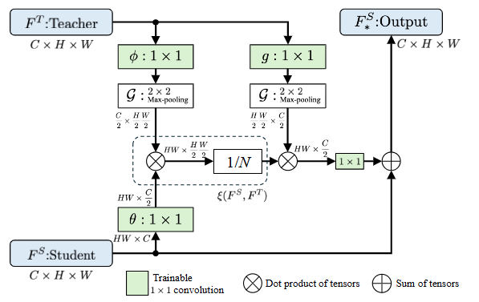

# CanKD: Cross-Attention-based Non-local operation for Feature-based Knowledge Distillation (WACV26)

<p>
  <a href="https://arxiv.org/abs/2511.21503" target='_blank'>
    
  </a>
</p>

⭐Official implementation of paper "CanKD: Cross-Attention-based Non-local operation for Feature-based Knowledge Distillation" (WACV 2026)

By Shizhe Sun(TDU), Wataru Ohyama(TDU)

🥇CanKD reaches the **Excellent** performance in multiple teacher-student architectures for dense prediction tasks, segmentation tasks, advanced models(**Including Dino, Grounding-Dino**) and large-scale datasets(**Object365v2 dataset**).
All achieved with a **single** distillation loss function.

<p align="center">
  
  
  
</p>

### Experiment results
* Baseline settings:  (all weights is equal 5.)

  |        Student         |         Teacher         |  CanKD   |  CanKD $\dagger$  | 
  | :--------------------: | :---------------------: | :------: | :------: |
  | Faster RCNN-R50 (38.4) | Faster RCNN-R101 (39.8) |   40.1   |   40.7   |
  |  RetinaNet-R50 (37.4)  |  RetinaNet-R101 (38.9)  |   39.7   |   39.8   |
  |    FCOS-R50 (38.5)     |    FCOS-R101 (40.8)     |   42.4   |   42.4   |

* Stronger teachers:(all weights is equal 5.)

  |        Student         |            Teacher            |   CanKD | CanKD $\dagger$  |
  | :--------------------: | :---------------------------: | :------: | :------: |
  | Faster RCNN-R50 (38.4) | Cascade Mask RCNN-X101 (45.6) |   42.0   | 42.5 |
  |  RetinaNet-R50 (37.4)  |     RetinaNet-X101 (41.0)     |   41.0   | 41.1 |
  |  RepPoints-R50 (38.6)  |     RepPoints-R101 (44.2)     |   42.4   | 42.6 |

* Heterogeneous teacher(all weights is equal 5.)
  
  |        Student         |         Teacher         |  CanKD   |
  | :--------------------: | :---------------------: | :------: |
  | RetinaNet-R50 (37.4)   | FCOS-X101 (42.7)        |   40.5   |
  
😊**Note: You can find all training config file in [Link](configs/distill/mmdet/nlkd) for dense prediction tasks.**
  
* Semantic segmentation(mIoU) (Here we use weight=10 when PSPNet-R101 as teacher and DeepLabV3-R18 as student following the ablation experiment and others are all 5)

  |        Student         |         Teacher         |  CanKD   |    Config    |                    
  | :--------------------: | :---------------------: | :------: |:------: |
  | PSPNet-R18 (74.87)     | PSPNet-R101 (79.74)     |   76.24  |[config](configs/distill/mmseg/nlkd/nlkdIN_feature_pspnet_r101-d8_pspnet_r18-d8_4xb2-80k_cityscapes-512x1024.py)|
  | DeepLabV3-R18 (76.70)   | PSPNet-R101 (79.74)    |   77.34  |[config](configs/distill/mmseg/nlkd/nlkdIN_feature_w10_pspnet_r101-d8-deeplabv3_r18-d8_80k_cityscapes-512x1024.py)|
  | DeepLabV3-R18 (76.70)   | DeepLabV3-R101 (80.31) |   77.12  |[config](configs/distill/mmseg/nlkd/nlkdIN_feature_deeplabv3_r101-d8_deeplabv3_r18-d8_80k_cityscapes-512x1024.py)|
  | DeepLabV3-Mv2 (73.84)   | DeepLabV3-R101 (80.31) |   75.62  |[config](configs/distill/mmseg/nlkd/nlkdIN_feature_deeplabv3_r101-d8_deeplabv3_mv2-d8_80k_cityscapes-512x1024.py)|
* Advanced model and Large-scale dataset. (all weights is equal 5.)
 
  |        Student         |         Teacher         |  CanKD   |  config  | log|
  | :--------------------: | :---------------------: | :------: | :------: |:------: |
  | Dino-R50 (49.0)        | Dino-R101 (50.4)        |   49.7 |  [config](configs/distill/mmdet/nlkd/nlkd_dino-r101_dino-r50_12e_coco.py)  |[log](logfile/dino.log)|
  |  GroundingDino-R50 (48.9)  |  GroundingDino-R101 (50.0)  |   49.8   |   [config](configs/distill/mmdet/nlkd/nlkd_ggdino-r101_ggdino-r50_1x_coco.py)  |[log](logfile/groundingdino.log)|
  |    RetinaNet-R50(Object365v2) (16.7)     |     RetinaNet-R101(Object365v2) (19.5)     |   18.4   |  [config](configs/distill/mmdet/nlkd/nlkdD_fpn_retinanet-r101_retinanet-r50_1x_objects365v2.py)  |[log](logfile/object365.log)|

### Installation
Our code is based on the Openmmlab mmrazor platform. [Link](https://github.com/open-mmlab/mmrazor).

⚠️⚠️⚠️⚠️**Attention**: Because the mmrazor installation guide has mistakes, so here **DO NOT INSTALL mmcv=2.2.0 !!**. **And mmcv=2.1.0 is not suitable for mmcls, so we do not recommend.**
Our enviroment:
* Python=3.8.18
* Torch=2.0.1
* CUDA=11.7
* mmcv=2.0.0, mmengine=0.10.5, mmdet=3.1.0, mmsegmentation=1.2.2, mmrazor=1.0.0, mmcls=1.0.0rc6

We recommend install mmcv by
```shell
pip install mmcv==2.0.0 -f https://download.openmmlab.com/mmcv/dist/cu117/torch2.0/index.html
```

⚠️**Attention**: mmdet=3.1.0 did not included Dino and Grounding-Dino. If you want to train on these models, please upgrade mmdet.

You can read [mmrazor/README.md](mmrazor/README.md) to finish your remaining installation. After installing **openmim**, you can install other Openmmlab library like mmdet by using

```shell
mim install mmdet=3.1.0
```

### Training
You can read [mmrazor/README.md](mmrazor/README.md) to understand how to training distillation model.
#### Training student
```shell
cd CanKD
bash ./tools/dist_train.sh ${path/to/your/config} ${GPUS}
```
In paper we set GPUS=2
⚠️⚠️**If you use more GPUs or less GPUs for training, please following the  [linear scaling rule](https://mmdetection.readthedocs.io/en/latest/user_guides/train.html#train-with-customized-datasets) in mmdetection README file.**
#### For segmentation task
For semantic segmentation, please see [configs/distill/mmseg/nlkd](configs/distill/mmseg/nlkd) folder to choose your training config files

🔥**If you want to focuse our training loss file, please see [mmrazor/models/losses/nlkd_IN_loss.py](mmrazor/models/losses/nlkd_IN_loss.py)** 

Careful, because we use MSE loss with 
```code
loss = F.mse_loss(n_z_s, n_z_t) /2
```
Our weight will be dividing 2.(If you set loss_weight=10, it actually means your training weight is 5.)

### Possibly issue & Additional tool
If you can not training **reppoints** network. Please focusing on [#10440](https://github.com/open-mmlab/mmdetection/pull/10440).

In our code, we have already repaired the [feature_diff_visualization.py](tools/visualizations/feature_diff_visualization.py) bug through [#624](https://github.com/open-mmlab/mmrazor/issues/624). After setting [vis_config/fpn_feature_visualization.py](tools/visualizations/vis_configs/fpn_feature_visualization.py) recoder name. (You can read the [#654](https://github.com/open-mmlab/mmrazor/issues/654) or use [architecture_find.py](architecture_find.py) to define architecture name.) You can follow the [docs/zh_cn/user_guides/visualization.md](docs/zh_cn/user_guides/visualization.md) to visualize your heatmap.

We also provide [confusion_matrix.py](mmdetection_test/confusion_matrix.py) and [test_robustness.py](mmdetection_test/test_robustness.py) to help you create confusion matrix and test robustness. You can read [confusion_matrix](https://mmdetection.readthedocs.io/en/latest/user_guides/useful_tools.html#confusion-matrix) and [robustness_benchmarking](https://mmdetection.readthedocs.io/en/latest/user_guides/robustness_benchmarking.html) to get more detail. **Note: You need to convert your distillation .pth by using [convert_kd_ckpt_to_student.py](tools/model_converters/convert_kd_ckpt_to_student.py) first.**

### Acknowledgement
This repository is build upon the [MGD](https://github.com/yzd-v/MGD), [PKD](https://github.com/open-mmlab/mmrazor), [mmrazor](https://github.com/open-mmlab/mmrazor) repository.

### License  

This project is released under the [Apache 2.0 license](LICENSE).

### Citation
If you use CanKD for your research, please cite our work by using the following BibTeX entry:
```
@misc{sun2025cankdcrossattentionbasednonlocaloperation,
      title={CanKD: Cross-Attention-based Non-local operation for Feature-based Knowledge Distillation}, 
      author={Shizhe Sun and Wataru Ohyama},
      year={2025},
      eprint={2511.21503},
      archivePrefix={arXiv},
      primaryClass={cs.CV},
      url={https://arxiv.org/abs/2511.21503}, 
}
```


  
  
  
  


